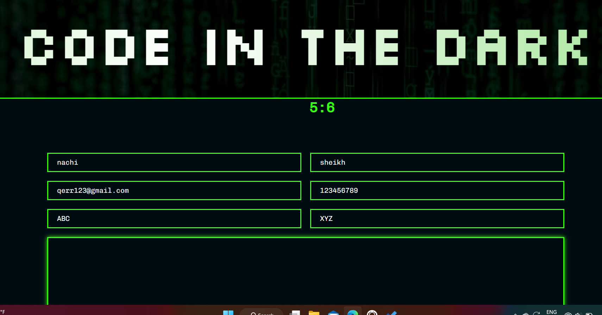

# Code in the Dark Text Editor
This is a text editor created using HTML, CSS, and JavaScript for the Code in the Dark event in my college. The code in dark is event where a user or competitor have to write code in html,css and js without seeing it on screen and without previewing it only host user or judges can see it.

## Technologies Used
* HTML
* CSS
* JavaScript
* jQuery

## Screenshots

## Getting Started
### for users
To use the text editor, simply open the index.html file in your web browser. You can create a new file by clicking the "New File" button, and open an existing file by clicking the "Open File" button. To save a file, click the "Save File" button.

To use the syntax highlighting and auto-complete features, simply start typing in the editor. The text editor will automatically highlight syntax and provide suggestions for auto-complete.
### for Host users
To search for a specific text, click the "Find" button and enter the text you want to search for. To replace text, click the "Replace" button and enter the text you want to replace and the replacement text.
